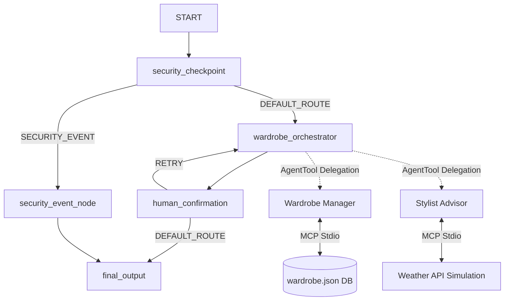

# Submission Writeup: Personal Wardrobe Stylist

## Problem Statement
Selecting daily outfits that align with the weather, social events, and style guidelines is a common decision-fatigue issue. Simultaneously, user privacy must be respected: cataloging personal clothing logs and locations shouldn't leak PII, and the agent should remain protected against malicious prompts or inappropriate requests.

The **Personal Wardrobe Stylist** solves this by providing a context-aware, secure wardrobe manager and styling advisor that allows humans to approve styling suggestions before they are finalized.

---

## Solution Architecture

---

## Concepts Used

1.  **ADK Workflow**: Main graph defined in [agent.py](file:///e:/ADK-Worksapce/wardrobe-stylist/app/agent.py#L215-L218) using the `Workflow` class and standard `Edge` routes.
2.  **LlmAgent**: Three specialized agents constructed in [agent.py](file:///e:/ADK-Worksapce/wardrobe-stylist/app/agent.py#L143-L200): `wardrobe_orchestrator` (mode: `single_turn` for graph execution), and `wardrobe_manager` & `stylist_advisor` (mode: `chat` for inner task runner execution).
3.  **AgentTool**: Used by `wardrobe_orchestrator` in [agent.py](file:///e:/ADK-Worksapce/wardrobe-stylist/app/agent.py#L195-L198) to coordinate and delegate styling or cataloging tasks to the sub-agents.
4.  **MCP Server**: Implemented using `FastMCP` in [mcp_server.py](file:///e:/ADK-Worksapce/wardrobe-stylist/app/mcp_server.py) to manage wardrobe database calls and weather data access.
5.  **Security Checkpoint**: Implemented as a Workflow node `security_checkpoint` in [agent.py](file:///e:/ADK-Worksapce/wardrobe-stylist/app/agent.py#L35-L98) executing validation and redaction rules.
6.  **Agents CLI**: Scaffolded and run via `agents-cli` and `adk web` commands.

---

## Security Design

The `security_checkpoint` node enforces four security layers:
*   **PII Redaction**: Email, Phone, and Credit Card numbers are scrubbed using regex patterns to protect personal data.
*   **Prompt Injection Detection**: Blocks command overrides (e.g., `"ignore previous instructions"`) and routes traffic immediately to `security_event_node`.
*   **Content Filters**: Filters inappropriate wardrobe-related requests (e.g., `"nude"`, `"naked"`, `"explicit"`).
*   **Structured Audit Logging**: Outputs JSON audit logs detailing the request metadata and flagging severity (`INFO`, `WARNING`, `CRITICAL`) for observability.

---

## MCP Server Design

Exposes four stdio tools in [mcp_server.py](file:///e:/ADK-Worksapce/wardrobe-stylist/app/mcp_server.py):
*   `list_wardrobe_items()`: Reads the wardrobe JSON DB to return clothing catalog information.
*   `add_wardrobe_item(name, category, color, material)`: Writes a new item to the local JSON database.
*   `log_wear_frequency(item_id)`: Increments the wear counter for tracking outfit utility.
*   `get_weather_forecast(city)`: Fetches simulated forecast details to align suggestions with temperatures.

---

## Human-in-the-Loop (HITL) Flow

Implemented in [agent.py](file:///e:/ADK-Worksapce/wardrobe-stylist/app/agent.py#L107-L135):
*   When the orchestrator proposes a styling recommendation, it sets `needs_human_confirmation = True` in `ctx.state`.
*   The `human_confirmation` node checks the state, pauses execution, and yields a `RequestInput` card back to the client interface.
*   If the user approves (`"yes"`), the workflow routes to `final_output`.
*   If the user rejects (`"no"`), the state is updated with feedback, and the workflow routes back to the orchestrator to fetch a different option.

---

## Impact / Value Statement
The **Personal Wardrobe Stylist** makes cataloging wardrobe items frictionless while enhancing outfit coordination. It reduces daily decision fatigue, maximizes clothing utilization through wear tracking, protects user data through edge safety filters, and gives users full control over LLM recommendations with human confirmation gates.
